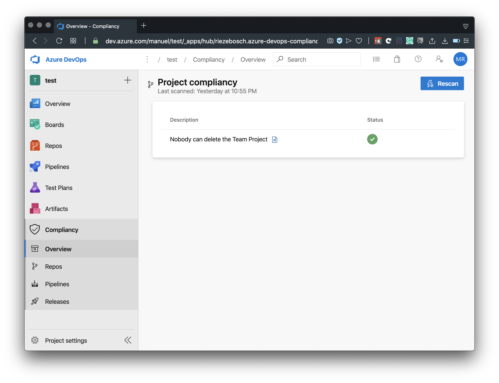

# Azure DevOps Compliance - Extension

Here is the home of the Azure DevOps extension that show the status of projects in an Azure DevOps organization.

## Rules

A [set of rules](https://github.com/azure-devops-compliance/rules) evaluates the status of your projects and items in these
projects. For example te settings of a repository that demand 4-eyes approval on a code change by using pull-request policies.

## Functions

One way to evaluate (and reconcile) these rules is deploying these [azure functions](https://github.com/azure-devops-compliance/azure-functions).

## Shared Secret

The azure functions expect an authorization token to be sent which is encrypted with the certificate from this extension. So
you must have access to that secret when deploying the azure functions. Unfortunately it is a symmetric key so we cannot
publicly share it.

For now you have the following options to make it work:

1.  Ask us for the key
1.  Roll your own extension
1.  Disable the authentication
